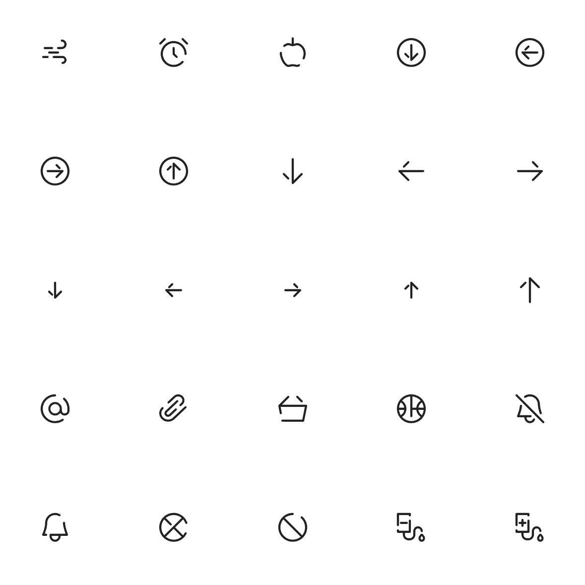

# swm_icons

The SWM Icon pack for Flutter. Provides 200+ additional icons to use in your apps.

## Instalation

In the `dependencies:` section of your `pubspec.yaml`, add the following line:

```yaml
swm_icons: <latest_version>
```

## Usage

You can use it very easily. For example:

```dart
import 'package:flutter/material.dart';
import 'package:swm_icons/swm_icons.dart';

class MyApp extends StatelessWidget {
  @override
  Widget build(BuildContext context) {
    return SWMIcon(SWMIcons.alarm);
  }
}
```

## Icon Styles

You can use `SWMIconStyles` to change the style, (default: `SWMIconStyles.outline`).

```dart
import 'package:flutter/material.dart';
import 'package:swm_icons/swm_icons.dart';

class MyApp extends StatelessWidget {
  @override
  Widget build(BuildContext context) {
    return SWMIcon(
      SWMIcons.alarm,
      style: SWMIconStyles.broken, // Broken icon style.
      color: Colors.blue,
      size: 40,
    );
  }
}
```

## Icons



## License

MIT
